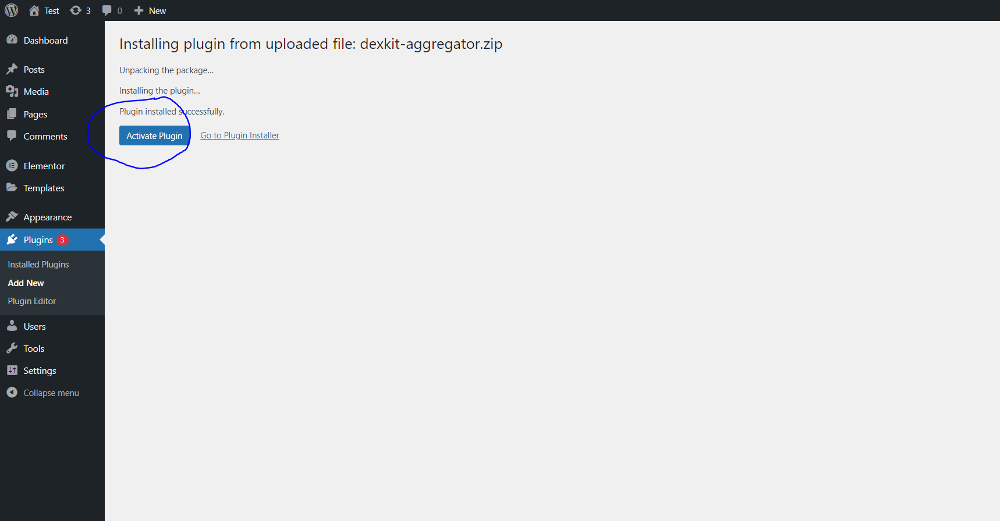
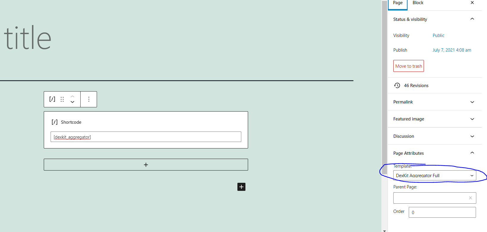

# How to Install Aggregator Plugin

[PLUGIN FILE](../../dexkit-aggregator.zip)

1. Follow these instructions to increase the upload limit of your wordpress site:
https://www.wpbeginner.com/wp-tutorials/how-to-fix-the-link-you-followed-has-expired-error-in-wordpress/

2. Go to the Plugin tab and click on "ADD NEW"

3. Click on "Upload Plugin"

4. Click the button to choose the file on your computer 

5. After selecting the  [Dexkit plugin file](../../dexkit-aggregator.zip)
Click "Install Now"

6. After installation is complete, click on "Active Plugin"

7. Select the "Dexkit NFT" tab from the menu. Click on the "Fetch" button.

8. Now let's add the Dexkit plugin to a page. Using the side menu, click on Pages and then on Add New.

9. Add a shortcode to the new page. Follow this tutorial if you can't add a shortcode: https://www.wpbeginner.com/wp-tutorials/how-to-add-a-shortcode-in-wordpress/

10. Type the Dexkit plugin tag in the shortcode: [dexkit_aggregator]

Full shortcode options

- logo - url to logo used in light mode
- logo_dark - url to logo used in dark mode
- brand_color - brand color used in light mode
- brand_color_dark - brand color used in dark mode
- is_dark_mode - default to dark mode
- height -  height size of the aggregator
- width - width size of the aggregator
- matic_as_default - use Polygon as default network when open aggregator
- bsc_as_default - use Binance Smart Chain as default network when open aggregator
- default_token_address_eth - Default token on ETH network
- default_token_address_bsc - Default token on Binance Smart Chain network
- default_token_address_matic - Default token on Polygon network
- default_slippage - Default slippage of the aggregator, useful for tokens that need higher slippage to trade

Full Example

`[dexkit_aggregator height="800px" width="100%" logo="path_to_logo" logo_dark="path_to_logo" is_dark_mode="true" matic_as_default="false" bsc_as_default="false" default_token_address_eth="0x7866E48C74CbFB8183cd1a929cd9b95a7a5CB4F4" default_token_address_bsc="0x314593fa9a2fa16432913dbccc96104541d32d11" default_token_address_matic="0x4d0def42cf57d6f27cd4983042a55dce1c9f853c"  default_slippage="2" brand_color="#ff7149" brand_color_dark="#2172E5" ]`

If you need your aggregator as full page, you can select template as 

Congratulations, you have just finished the Aggregator plugin installation process on your
wordpress site.

