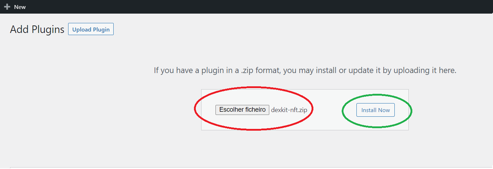
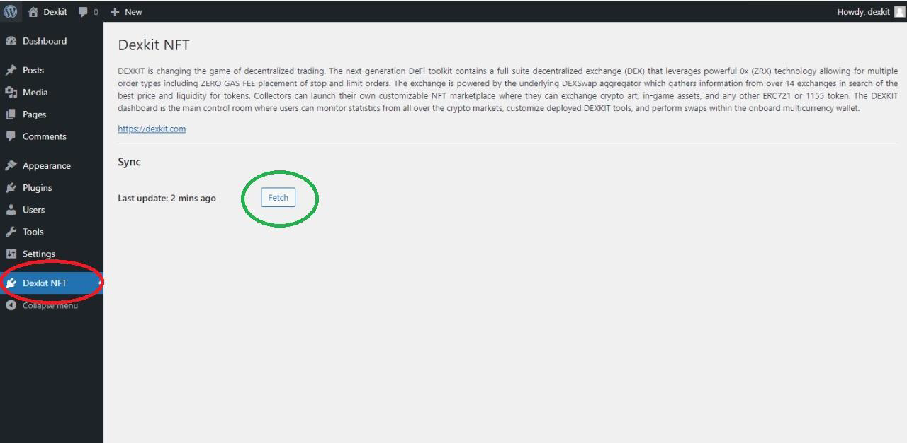
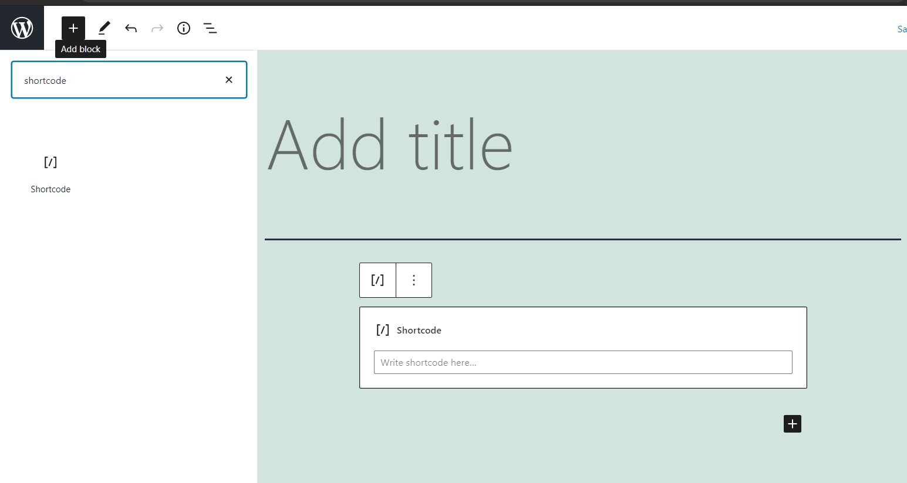

# How to Install NFT Marketplace Plugin

[PLUGIN FILE](../../dexkit-nft.zip)

1. Follow these instructions to increase the upload limit of your wordpress site:
https://www.wpbeginner.com/wp-tutorials/how-to-fix-the-link-you-followed-has-expired-error-in-wordpress/

2. Go to the Plugin tab and click on "ADD NEW"

3. Click on "Upload Plugin"

4. Click the button to choose the file on your computer 

5. After selecting the Dexkit plugin file (dexkit-nft.zip)
Click "Install Now"

6. After installation is complete, click on "Active Plugin"

7. Select the "Dexkit NFT" tab from the menu. Click on the "Fetch" button.

8. Now let's add the Dexkit plugin to a page. Using the side menu, click on Pages and then on Add New.

9. Add a shortcode to the new page. Follow this tutorial if you can't add a shortcode: https://www.wpbeginner.com/wp-tutorials/how-to-add-a-shortcode-in-wordpress/

10. Type the Dexkit plugin tag in the shortcode: [dexkit_nft]

Congratulations, you have just finished the Marketplace plugin installation process on your
wordpress site.

If you have an account with cards and want to show it with your community you can pass like this way:

[dexkit_marketplace nft_creator="valid_address"]